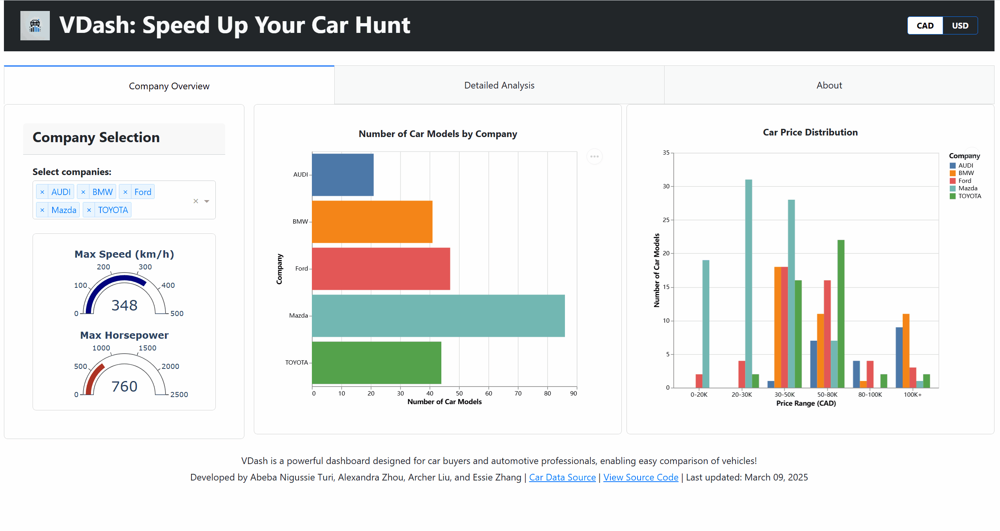

# VDash: Speed Up Your Car Hunt

[](https://www.repostatus.org/#active)
[](https://www.python.org/downloads/release/python-390/)
[](https://opensource.org/licenses/MIT)

## Summary

Welcome to VDash, an interactive dashboard for car buyers and automotive professionals to compare vehicles! Effortlessly compare vehicles based on performance, pricing, and key features with dynamic filters and interactive visuals.

## Motivation and Purposes

VDash is a user friendly interactive vehicle comparison dashboard customized for buyers in Canada. Choosing the right car can be overwhelming, and this dashboard simplifies the process by empowering users with data-driven insights. It is designed to assist users in making informed vehicle purchasing decisions through dynamic data visualization and exploration of the market through visual  aids. The dashboard enables users to filter and compare cars based on multiple attributes such as price, horsepower, battery/engine capacity, speed, fuel type, seating capacity, and car type. By providing an interactive experience, the dashboard allows users to visualize trends, compare specifications across different models, and identify the best options based on their preferences.

## Key Features

VDash empowers users with interactive tools to explore and compare vehicles efficiently. With VDash, you can:

- **Compare Vehicles Across Multiple Attributes**: Filter cars by price, horsepower, battery/engine capacity, speed, fuel type, seating capacity, and car type to find the best fit for your needs.

- **Visualize Market Trends**: Use dynamic plots to understand pricing distributions, performance differences, and how various car models compare.

- **Make Data-Driven Decisions**: Gain insights into key vehicle attributes with side-by-side comparisons and interactive visual analytics.

- **Customize Your Search**: Adjust sliders and dropdowns to refine your car search quickly and effectively. Toggle between CAD & USD pricing to view costs in your preferred currency.

- **Enhance Your Car Buying Experience**: Whether you’re a buyer, seller, or automotive enthusiast, VDash simplifies complex comparisons and helps you make informed purchasing decisions.

## Usage



## Installation

1. Clone the repository

   ```bash
   git clone https://github.com/UBC-MDS/DSCI-532_2025_4_vdash.git
   ```

2. Navigate to the project directory

   ```bash
   cd PATH_TO/DSCI-532_2025_4_vdash
   ```

3. Set up and activate the virtual environment

   ```bash
   conda env create -f environment.yml
   conda activate vdash
   ```

4. Run the dashboard

   ```bash
   python src/app.py
   ```

## Support

Encountering issues? Need assistance? For any questions regarding this dashboard, please open an issue in the GitHub repository.

## Contributing

Interested in contributing? Check out the contributing guidelines at [CONTRIBUTING.md](https://github.com/UBC-MDS/DSCI-532_2025_4_vdash/blob/main/CONTRIBUTING.md) for details. Please note that this project is released with a [Code of Conduct](CODE_OF_CONDUCT.md). By contributing to this project, you agree to abide by its terms.

## License

`DSCI-532_2025_4_vdash` was created by Abeba Nigussie Turi, Alexandra (Yining) Zhou, Archer Liu and Essie Zhang. It is licensed under the terms of the [MIT](https://github.com/UBC-MDS/DSCI-532_2025_4_vdash/blob/main/LICENSE) license.

## Happy car hunting with VDash!
