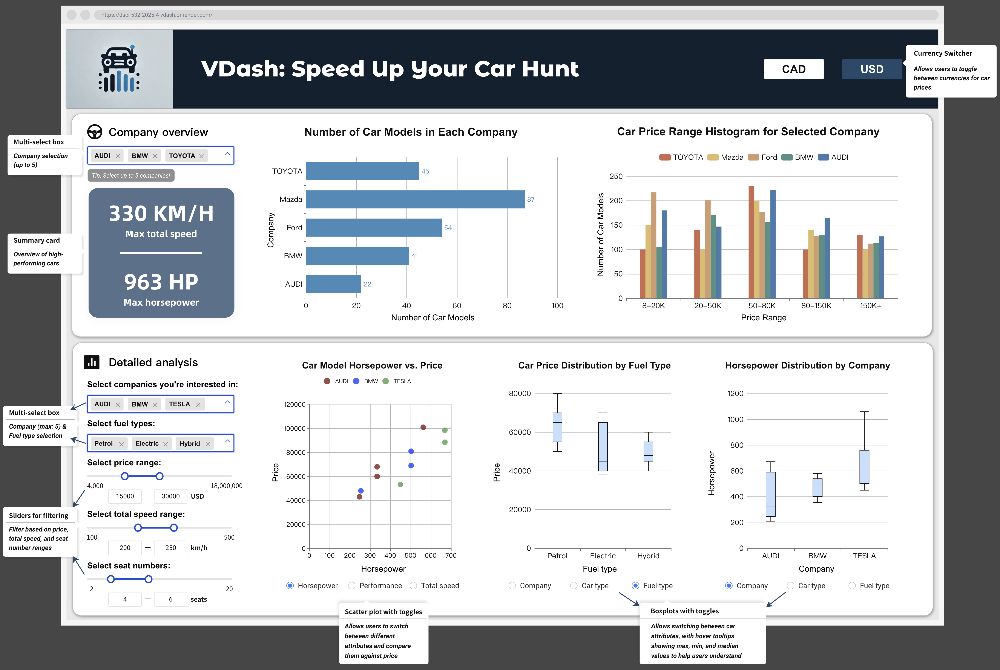

# Proposal

## Section 1: Motivation and Purpose

Our role: Data Scientist Consultancy Firm

Target audience: Car Buyers and Automotive Enthusiasts

Buying a car is a significant decision that takes multiple factors into account. Many buyers struggle to navigate vast amounts of data and make informed choices that best suit their needs. To address this challenge, we propose building an interactive car comparison dashboard that allows users to visually explore and compare different vehicle models in the market based on key specifications. Our dashboard will feature dynamic filters and visualizations, enabling users to adjust criteria such as price range, horsepower, fuel type, and seating capacity to find the best options. By providing an intuitive and interactive experience, our tool aims to simplify car selection and empower buyers with data-driven insights.

## Section 2: Description of the data

-TO DO-

## Section 3: Research questions and usage scenarios

### Research questions

The following research questions will guide the interactive analysis of this dashboard:

- How do car prices vary across different manufacturers and fuel types?  
- What is the distribution of horsepower across different car types and price ranges?
- How does battery capacity (for EVs) or engine CC (for fuel cars) correlate with total speed and acceleration performance? 
- Which car types offer the best balance of price and performance (horsepower vs. acceleration time)?  
- How does seating capacity influence price and fuel type choices?

### Usage Scenario

Emily is a mother of two living in Richmond, a suburb of Vancouver. She is looking for a spacious and safe family vehicle to accommodate her kids and their belongings. With frequent weekend trips to Whistler and interior BC, she needs a car with good highway performance and cargo space.  

Emily wants to find a family-friendly vehicle with ample seating, cargo space, and good safety features while staying within a budget.  

Tasks:

[Filter] by seating capacity (minimum 5 seats) to ensure enough space for her family.
[Set] a price range of $30,000 to $50,000 CAD to see cars within her budget.
[Compare] SUVs and minivans to assess comfort, space, and fuel efficiency.
[Check] performance metrics such as horsepower and total speed for highway travel.

Emily opens VDash and selects the 6-seater option in the seating capacity filter. She then sets the price range and compares SUVs and minivans side by side. She also checks the fuel type filter, prioritizing hybrid options to reduce long-term fuel costs. The dashboard dynamically updates, showing available options with key performance metrics like horsepower, battery capacity, and highway speed.  

Emily finds that hybrid SUVs provide the best combination of space and fuel efficiency. She selects a few options and plans a visit to local dealerships for test drives. 

## Section 4: App sketch & brief description

### Description

Our dashboard provides **interactive selectors** for dynamic filtering:

1. **Company Names** – Filter by one or multiple companies.
2. **Prices** – Set a price range using a slider.
3. **Total Speed** – Set a range for maximum speed.
4. **Fuel Types** – Filter by fuel type.
5. **Seats** – Filter by the number of seats.
6. (Optional, Feasibility TBD) **Car Types** – Filter by car types.

**Currency Toggle** – Switch between CAD and USD.

#### Dashboard Charts

##### Part 1: Company Overview

1. **Bar Chart: Car Model Count by Company**
   - **X-axis:** Company names
   - **Y-axis:** Car model count

2. **Histogram: Price Distribution for Selected Company**
   - **X-axis:** Price (bins)
   - **Y-axis:** Frequency

3. **Max Speed and Max Horsepower Display**
   - **Summary**: Displays max speed and horsepower.

##### Part 2: Detailed Analysis

1. **Scatter Plot: Car Model Comparison**
   - **X-axis Options:** Horsepower, Performance, Total Speed
   - **Y-axis:** Price
   - **Color:** Company
   - **Interaction:** Toggle X-axis options, with hover tooltips displaying all relavant car specifications.

2. **Box Plot: Price Distribution**
   - **X-axis:** Company, Car Type, Fuel Type
   - **Y-axis:** Price
   - **Interaction:** Switch between car attributes, with hover tooltips displaying max, min, and median values for easier understanding.

3. **Box Plot: Horsepower Distribution**
   - **X-axis:** Company, Car Type, Fuel Type
   - **Y-axis:** Horsepower
   - **Interaction:** Same as price box plot.
